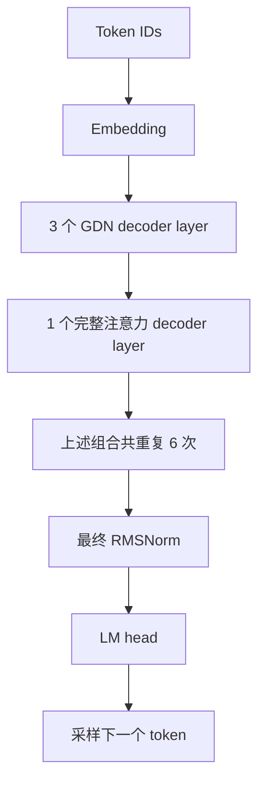

# Qwen3.5 适配详解：相比原版新增了什么

更新日期：2026-10-03。

本文对照适配前的 `516b9dd`（`Day 9`）与当前 `mtp` 分支工作区，解释 Qwen3.5-0.8B 纯文本推理适配的具体变化。当前工作区包含 `ea2089a` 的首次适配，以及后续复审修复；后续修复在撰写时尚未提交，因此只查看 `ea2089a` 会漏掉部分内容。

核心变化是：原来引擎只构造 Qwen3 的完整注意力模型，现在能够识别 Qwen3.5 的文本配置，执行由 **18 层 Gated DeltaNet（GDN）与 6 层完整注意力**组成的混合模型，并同时管理循环状态与 paged KV cache。文本模型的计算由本项目实现，Transformers 用于配置、分词及测试中的参考对照。

本文解释实现原理；实际运行命令见[运行与验证](qwen3_5_text_inference.md)，后续安排见[实施计划](qwen3_5_0_8b_mtp_plan.md)。

## 1. 变化总览

| 方面 | 适配前 | 当前版本 |
| --- | --- | --- |
| 模型选择 | `ModelRunner` 直接创建 `Qwen3ForCausalLM` | 根据文本配置选择 Qwen3 或 Qwen3.5 |
| 配置结构 | 直接使用顶层配置 | 支持多模态 checkpoint 中嵌套的 `text_config` |
| decoder 结构 | 各层使用 Qwen3 完整注意力 | 按 `layer_types` 构造 GDN / 完整注意力混合层 |
| 跨 token 历史 | 各注意力层的 K/V | 完整注意力层的 K/V，加上 GDN 的卷积历史与循环矩阵 |
| Qwen3.5 注意力细节 | 无对应实现 | 增加输出门控、zero-centered RMSNorm、partial RoPE |
| KV 显存分配 | 按 `num_hidden_layers` 分配 | 按实际拥有 K/V cache 的模块数量分配 |
| 请求状态管理 | KV block table | KV block table 与稳定的 GDN state slot 配合 |
| prefix caching | 原有基于 KV block 的前缀复用 | Qwen3 继续使用；Qwen3.5 自动关闭 |
| Qwen3.5 执行方式 | 不支持 | 单卡 CUDA、eager；完整注意力继续用 FlashAttention |
| 贪心解码 | 不允许零温度 | `temperature=0` 选择 argmax |
| 权重检查 | 主要按名称复制参数 | 增加命名映射、明确跳过的模块及完整性检查 |
| 验证 | 无本次新增的验证集 | 小模型数值对照、真实权重对照、状态与异常边界测试、Qwen3 回归 |

原版已经具备 **paged KV、chunked prefill、请求抢占与重算、prefix caching、Tensor Parallel 和 CUDA Graph**。本次复用了这些基础设施中的适用部分，并补上混合模型所需的状态语义。不能把这些原有机制都算成本次新增。

## 2. 新增文件与修改入口

### 2.1 新增的运行时代码

| 文件 | 新增职责 |
| --- | --- |
| [`models/qwen3_5.py`](../nanovllm/models/qwen3_5.py) | Qwen3.5 文本模型、混合 decoder、完整注意力、归一化、RoPE、MLP、共享 embedding/LM head |
| [`layers/gated_delta_net.py`](../nanovllm/layers/gated_delta_net.py) | GDN 输入投影、因果卷积、delta rule、输出门控及历史状态 |
| [`engine/state_manager.py`](../nanovllm/engine/state_manager.py) | `seq_id → state slot` 映射及 slot 的分配、保留、释放 |
| [`models/registry.py`](../nanovllm/models/registry.py) | `create_model(config)` 模型工厂，分发到两条模型路径 |

### 2.2 原有文件的改动

| 文件 | 主要变化 |
| --- | --- |
| [`config.py`](../nanovllm/config.py) | 文本配置归一化、模型类型与能力限制、dtype、EOS、模型相关默认并发数 |
| [`engine/model_runner.py`](../nanovllm/engine/model_runner.py) | 模型工厂、按实际层数分配 KV、传递请求范围与状态槽、清理状态和初始化异常 |
| [`engine/llm_engine.py`](../nanovllm/engine/llm_engine.py) | 输入校验、完整批次校验后入队、向 runner 传递活跃请求、释放结束请求状态 |
| [`engine/scheduler.py`](../nanovllm/engine/scheduler.py) | 活跃请求容量约束、物理 KV 容量检查、多 EOS 支持 |
| [`engine/block_manager.py`](../nanovllm/engine/block_manager.py) | 新增 prefix caching 开关 |
| [`utils/context.py`](../nanovllm/utils/context.py) | 增加 `request_ranges`、`state_indices` |
| [`utils/loader.py`](../nanovllm/utils/loader.py) | 权重名称转换、加载报告、形状与缺失检查、共享参数识别、packed shard 完整性检查 |
| [`layers/sampler.py`](../nanovllm/layers/sampler.py)、[`sampling_params.py`](../nanovllm/sampling_params.py) | 支持零温度贪心解码，校验温度与输出预算 |
| [`models/qwen3.py`](../nanovllm/models/qwen3.py) | 增加共享权重名称说明，兼容更严格的 loader |
| [`pyproject.toml`](../pyproject.toml) | 调整 Transformers 版本范围，显式声明已使用的辅助依赖 |

示例、验证脚本与测试的用途分别见第 10、11 节。

## 3. 配置与模型选择：从固定 Qwen3 到两条模型路径

原来 `ModelRunner` 固定创建 Qwen3 模型，且直接读取顶层配置的 `num_hidden_layers`、`hidden_size` 等字段。Qwen3.5-0.8B 的实际 checkpoint 顶层包含文本、视觉等配置，需要先取出语言模型配置。

当前 `Config` 同时保留：

- `hf_config`：完整 checkpoint 配置。
- `hf_text_config`：存在 `text_config` 时取该字段，否则直接使用顶层配置。
- `is_hybrid`：根据文本 `model_type == "qwen3_5_text"` 判断是否走本次混合模型路径。
- `model_dtype`：使用文本配置中的 dtype，缺省为 BF16。

模型工厂根据归一化后的配置创建原有 `Qwen3ForCausalLM` 或新增 `Qwen3_5ForCausalLM`。当前明确接收的文本模型类型为 `qwen3` 和 `qwen3_5_text`；这还不是面向任意架构的通用注册系统。

| 设置 | Qwen3 路径 | Qwen3.5 路径 |
| --- | --- | --- |
| 未指定 `max_num_seqs` 时 | 512 | 8 |
| `enforce_eager` | 沿用用户设置 | 强制为 `True` |
| `enable_prefix_caching` 未指定时 | `True` | `False` |
| 显式要求 prefix caching | 可用 | 抛出错误 |
| `tensor_parallel_size > 1` | 保留原实现及其约束 | 抛出错误 |

配置还会检查并发数、token 预算、上下文长度为正，以及显存利用率在 `(0, 1]`。`max_model_len` 按文本配置的上限截断。

官方配置写有 `max_position_embeddings=262144`，但当前引擎默认上下文为 4096，新示例使用 1024。读取到模型配置上限不代表已经验证或能在本机显存中运行 262144 token。

## 4. 模型计算：Qwen3.5 为什么需要独立实现

### 4.1 混合 decoder 结构

本地官方 Qwen3.5-0.8B 配置的关键字段如下。这些值用于解释当前 checkpoint，代码主要从配置读取，并未把所有尺寸写死。

| 参数 | 当前 checkpoint 的值 |
| --- | --- |
| 文本层数 | 24 |
| 层排列 | `[GDN, GDN, GDN, Full Attention]` 重复 6 次 |
| hidden size / MLP intermediate size | 1024 / 3584 |
| 完整注意力 query heads / KV heads / head dim | 8 / 2 / 256 |
| GDN key heads / value heads | 16 / 16 |
| GDN key head dim / value head dim | 128 / 128 |
| GDN 卷积核长度 | 4 |
| 词表大小 | 248320 |
| partial rotary factor | 0.25 |
| 权重类型 / embedding 共享 | BF16 / 开启 |

`Qwen3_5TextModel` 遍历 `layer_types` 创建对应层。每层仍有归一化、残差连接和 MLP；中间负责混合 token 信息的模块由层类型决定。



新 decoder 显式执行两次残差相加。原 Qwen3 路径通过已有 RMSNorm 实现传递并融合 residual；新路径采用更直接的 PyTorch 表达，便于核对 Qwen3.5 的计算过程。

### 4.2 完整注意力：复用 FlashAttention，补齐外围计算

完整注意力继续调用原有 `layers/attention.py`，因此 FlashAttention、paged KV 写入与查询等基础实现得到复用。新增的是它前后的 Qwen3.5 计算：

1. 单独的 Q、K、V 投影。开启 `attn_output_gate` 时，Q 投影还输出一份门控向量。
2. 按每个 query head 拆分 query 和 gate，避免把整个投影错误地分成两个连续大块。
3. Q/K 使用 Qwen3.5 对应的归一化，再对部分维度应用 RoPE。
4. 调用已有 Attention 得到注意力输出。
5. 输出逐元素乘以 `sigmoid(gate)`，再经过 `o_proj`。

以当前尺寸为例，Q 投影输出为 `8 × 256 × 2 = 4096` 维，其中一半是 query，一半是按 head 排列的 gate；K、V 分别为 `2 × 256 = 512` 维。注意力输出拼接后是 2048 维，再投影回 hidden size 1024。

原版 Qwen3 的 Q/K/V 通过 `QKVParallelLinear` 打包，新路径采用独立 `nn.Linear`。因此原有 Qwen3 的 Tensor Parallel 与投影融合能力不会自动成为 Qwen3.5 的能力。

### 4.3 归一化与 RoPE 的差别

新增 `Qwen3_5RMSNorm` 使用 zero-centered 权重。忽略精度转换时，其计算为：

```text
rms(x) = x / sqrt(mean(x²) + eps)
output = rms(x) * (1 + weight)
```

原 Qwen3 的普通 RMSNorm 直接乘 `weight`。如果对 Qwen3.5 权重沿用原公式，即使能成功加载参数，计算结果也会出错。新实现用 FP32 做归一化与缩放，再转回输入 dtype。

`TextRotaryEmbedding` 支持当前配置的 `rope_type="default"` 和 partial RoPE：`256 × 0.25 = 64` 个维度参与旋转，其余维度保留。`inv_freq` 始终保留 FP32，包括调用 `.to(dtype=...)` 时，避免频率先被低精度舍入。

Qwen3.5 配置带有 MRoPE 字段。对于这里的纯文本输入，各位置轴取相同的文本位置，代码据此执行文本旋转。图片与视频需要的不同位置轴及多模态输入处理未接入。

### 4.4 MLP、embedding 与 LM head

新 MLP 明确写为：

```text
down_proj(silu(gate_proj(x)) * up_proj(x))
```

它采用三个独立线性层；原 Qwen3 的 `gate_up_proj` 是融合投影。新模型使用普通 `nn.Embedding` 与 `nn.Linear`，在 `tie_word_embeddings=True` 时将 embedding 与 LM head 指向同一个 Parameter。

prefill 时，`compute_logits()` 按 `cu_seqlens_q` 选出每条请求当前片段的最后一个 hidden state，避免对整个 prompt 的每个位置都做词表投影。对于尚未完成 prompt 的片段，调度器不会把该轮采样结果作为输出 token 提交。

## 5. Gated DeltaNet：本次新增的主要计算模块

### 5.1 从输入投影到状态更新

`GatedDeltaNet` 对 hidden states 做四组投影：

| 投影 | 用途 |
| --- | --- |
| `in_proj_qkv` | 生成 Q/K/V 的原始特征，随后做因果卷积 |
| `in_proj_z` | 输出归一化后的门控向量 |
| `in_proj_b` | 经 sigmoid 得到更新强度 `beta` |
| `in_proj_a` | 与 `A_log`、`dt_bias` 共同决定历史状态衰减 |

每条请求先将已有卷积历史与当前 `qkv` 投影拼接，执行 depthwise 一维因果卷积及 SiLU，再拆分 Q/K/V。卷积缓存保存的是原始投影的最近若干项，而非卷积结果。

当前模型 Q、K、V 各为 2048 维，因此卷积通道数为 6144。若配置中的 value heads 是 key heads 的整数倍，代码会按 head 重复 Q/K；不满足整除关系时直接拒绝。

### 5.2 单 token decode 的递推

GDN 为每个 head 保留一个矩阵 `S`，形状为 `[key_head_dim, value_head_dim]`。下面把 Q/K 的 L2 归一化以及 query 的缩放视为已经完成，省略 batch/head 维，向量按列向量理解：

```text
beta_t = sigmoid(b_t)
g_t    = -exp(A_log) * softplus(a_t + dt_bias)

S_decay = exp(g_t) * S_(t-1)
delta_t = beta_t * (v_t - S_decay^T * k_t)
S_t     = S_decay + k_t * delta_t^T
o_t     = S_t^T * q_t
```

先衰减旧状态，再计算当前 value 与状态预测之间的差值，用该差值更新矩阵，最后通过 query 从矩阵读取输出。历史被汇总到固定大小的状态中，GDN 层不需要逐 token 保存完整 K/V。

随后执行 GDN 专用 `GatedRMSNorm` 与输出投影。这里的 norm 使用普通 learned scale，并乘 `SiLU(z)`；它与前面使用 `1 + weight` 的 `Qwen3_5RMSNorm` 是两个不同模块。

### 5.3 prefill 的分块计算

多个 token 的 prefill 如果逐个运行上述递推，会产生大量小操作。新增 `gated_delta_rule()` 将输入按默认 64 token 分块，通过累计衰减、因果矩阵和 `torch.linalg.solve_triangular` 计算块内更新，再依次传递块间状态。

这仍然实现同一条 delta recurrence。末尾不足 64 token 时进行 padding，返回时裁掉补齐部分；单 token 则直接走递推分支。

这里有两个独立的“分块”概念：

| 层级 | 控制方式 | 解决的问题 |
| --- | --- | --- |
| 调度器的 chunked prefill | `max_num_batched_tokens` | 一次调度允许处理多少 prompt token |
| GDN 算法内部的 chunk | `gated_delta_rule(..., chunk_size=64)` | 一次模型调用中如何组织 delta rule 的矩阵计算 |

原版已有第一种分块；第二种是本次新增。修改调度预算不会直接改变 GDN 内部的 64-token 块大小。

### 5.4 两类 GDN buffer 及精度

| Buffer | 每层形状 | 当前 dtype | 保存的内容 |
| --- | --- | --- | --- |
| `conv_states` | `[capacity, channels, kernel_size]` | 随模型，当前为 BF16 | 原始投影的卷积历史 |
| `recurrent_states` | `[capacity, value_heads, key_dim, value_dim]` | FP32 | delta recurrence 的状态矩阵 |

两者都是 `persistent=False` 的运行时 buffer，不属于模型 checkpoint 参数。状态矩阵和 delta rule 的主要计算保留 FP32，输出再转回输入 dtype；`.to(dtype=...)` 也不会把已有循环状态降到 BF16。

当前 GDN 使用 PyTorch 张量运算，包含按请求和按块的 Python 循环，没有新增 FLA、Triton 或 CUDA 的 GDN 融合 kernel。完整注意力使用的 FlashAttention 是另一条计算路径。

## 6. 混合缓存：KV block 与 GDN state slot 各管什么

### 6.1 完整注意力只分配 6 层 KV

原版按 `num_hidden_layers` 为模型分配 KV；对当前 24 层混合模型照搬这一做法，会为不使用完整 K/V 历史的 GDN 层也预留空间。

`ModelRunner.allocate_kv_cache()` 现在查找实际拥有 `k_cache`、`v_cache` 的模块，只为这些模块分配并绑定缓存。当前 checkpoint 因而分配 6 层 KV。

BF16、单卡和当前 head 配置下，忽略块内未使用位置与分配器开销：

```text
每个历史 token 的完整注意力 KV
  = 2(K/V) × 6 层 × 2 KV heads × 256 head_dim × 2 bytes
  = 12288 bytes = 12 KiB

每个 256-token block，覆盖全部 6 层
  = 256 × 12 KiB = 3 MiB
```

相对于错误地按 24 层计算，KV 部分是其四分之一。这不是“整个模型显存降到四分之一”的结论：模型权重、GDN 状态、激活和工作区都还需要显存，也不能据此直接比较 Qwen3-0.6B 的总显存。

### 6.2 GDN 状态按并发容量预分配

按当前尺寸，每条请求在一层 GDN 中需要：

```text
循环状态：16 × 128 × 128 × 4 bytes = 1 MiB
卷积状态：6144 × 4 × 2 bytes      = 48 KiB
```

18 层合计约 `18.84375 MiB / slot`。8 个 slot 约 150.75 MiB；若直接沿用原来的 512 请求默认值，仅这两类状态就约 9.42 GiB。以上是按 buffer 形状计算的容量，不含权重与临时张量。

因此 Qwen3.5 的默认 `max_num_seqs` 改为 8。buffer 在模型构造时按容量分配，释放请求表示 slot 可以复用，不代表每次都把这部分显存交回 CUDA 分配器。

完整注意力的 KV 随历史长度增长；GDN 的这两类持久状态大小由并发容量、层数和 head 尺寸决定。由于仍有 6 层完整注意力，整个混合模型的历史缓存并不是恒定大小。

### 6.3 为什么需要稳定的 `seq_id → slot`

一个请求在本轮 batch 中可能排第 0 位，下轮变成第 1 位；其他请求结束后，还会有新请求进入。若直接按 batch 行号存 GDN 状态，请求重排就可能读到别人的历史。

新增 `StateManager` 使用稳定的 `seq_id` 映射到固定 slot：

| 动作 | 行为 |
| --- | --- |
| `allocate(seq_id, cached_tokens)` | 返回已有 slot，或为尚未缓存的新请求分配 slot |
| 找不到 slot 但 `cached_tokens > 0` | 报错，防止带着缺失的 GDN 历史继续解码 |
| `retain(active_seq_ids)` | 释放已不活跃请求的 slot |
| `release(seq_ids)` | 请求结束后归还 slot |
| `clear()` | 清空映射，预热结束时会使用 |

具体 buffer 在 `prepare_states()` 发现 `cached_tokens == 0` 时清零。slot 归还后无需立即清空全部数据，下一次新请求使用前会重置。

### 6.4 packed batch 中如何定位每条请求

原引擎把多个请求的 token 拼接为一个一维输入。新增 Context 字段让 GDN 能找到各请求的输入段与历史状态：

```text
本轮输入：A 的 3 个 token，B 的 2 个 token
request_ranges = [(0, 3), (3, 5)]
state_indices  = [slot_A, slot_B]
```

`request_ranges` 描述当前输入片段，`state_indices` 描述对应 GDN buffer 的位置。两者与完整注意力使用的 `slot_mapping` 不同：后者定位每个 token 在 paged KV 中的物理位置。

下一轮即使改成先 B 后 A，只要传入 `[slot_B, slot_A]`，仍会使用正确历史。

## 7. 调度变化：把 GDN 状态接入已有请求生命周期

### 7.1 一条请求现在经历的流程

1. **输入校验**：检查非空、token ID 范围、上下文预算与实际 KV 容量。
2. **入队与分配**：调度器检查 KV block 和活跃请求容量，允许后分配 block。
3. **准备 GDN 状态**：runner 保留活跃请求的 slot，为新请求分配并清零状态。
4. **prefill**：完整注意力写入 KV，GDN 更新卷积与循环状态。
5. **分块继续**：如果 prompt 未消费完，保留两种历史，下一轮从 `num_cached_tokens` 继续。
6. **decode**：每轮消费上一轮生成的 token，更新两种历史并采样下一个 token。
7. **结束**：EOS 或输出预算触发结束，释放 KV block 并归还 GDN slot。

新的活跃容量检查统计 waiting/running 中已拥有 block table 的请求。因此一个尚处在分块 prefill 阶段的请求也会占用容量，避免新请求不断进入、最终耗尽 GDN slot。

### 7.2 抢占后如何恢复

原版已支持在 KV 空间不足时抢占请求、释放 block 并将请求放回 waiting。当前继续使用重算策略，同时把 GDN 状态纳入恢复过程：

1. 被抢占请求的 `num_cached_tokens` 归零，但完整 token 历史仍在 Sequence 中。
2. runner 根据仍拥有 block 的活跃请求回收无效 slot；如果同一请求已经重新进入，缓存长度为零也会触发状态重置。
3. 请求重新调度后，用保留的 prompt 与已生成 token 重算 KV 和 GDN 状态。
4. 恢复到正确历史后继续生成。

这里没有实现 GDN 中间状态快照或回滚；代价是抢占后需要重算。

### 7.3 为什么 Qwen3.5 关闭 prefix caching

原版 prefix caching 的复用对象是已经计算完成的 KV block。对混合模型，跳过一段相同前缀还需要得到该前缀结束时所有 GDN 层的卷积状态和循环矩阵。

目前没有为前缀缓存维护这些 GDN 快照。只恢复 KV 而把 GDN 留在零状态或其他历史上，会导致错误计算。因此 Qwen3.5 路径关闭前缀哈希登记与复用，显式要求开启时会报错。

这不影响同一请求在后续 prefill 片段和 decode 中使用自己的历史，也不取消 paged KV。Qwen3 路径继续使用原有 prefix caching。

## 8. 权重加载：从完整 checkpoint 取出文本主干

新增模型提供 `map_weight_name()`：

| checkpoint 名称 | 当前处理 |
| --- | --- |
| `model.language_model.*` | 映射到本地 `model.*` |
| `model.visual.*` | 明确跳过视觉模块 |
| `mtp.*` | 明确跳过 MTP 模块 |
| 其余参数 | 按模型参数名称加载；无法识别时失败 |

当前官方 checkpoint 实测加载了 **320 个文本参数条目**，跳过 **153 个视觉参数条目与 15 个 MTP 参数条目**。这里统计的是参数张量/名称条目，不是标量参数量。

loader 还增加了以下检查：

- 找不到任何 safetensors 文件时明确报错。
- 普通参数复制前要求形状完全一致，避免广播复制掩盖错误。
- 加载后检查是否缺少模型参数。
- 对原 Qwen3 使用的 packed 参数检查 shard 是否完整。
- 根据 Parameter 身份识别真正共享的 embedding / LM head，允许 checkpoint 只保存其中任意一个名称。
- 为原 Qwen3 的共享存储方式增加 `tied_weights_mapping`，适配新的完整性检查。

默认 shape 检查服务于普通参数；原有 TP/packed 参数仍由其专用 weight loader 完成切片和复制。加载统计保存在 `ModelRunner.weight_load_report`，验证脚本将其写入报告。

模型配置虽然包含 `mtp_num_hidden_layers=1`，本实现不会据此构造或执行 MTP。跳过这些权重与实现 MTP 是不同的工作阶段。

## 9. 公共行为与复审修复

### 9.1 采样与 EOS

`SamplingParams` 原来禁止近零温度；当前允许 `temperature=0`，由 sampler 返回原始 logits 的 argmax。正温度继续走原有随机采样方式，同一 batch 可以混合两种请求。负温度、NaN、无穷大温度以及非正输出预算会报错。

EOS 从文本配置读取；若本地存在 `generation_config.json`，使用其中相应设置。调度器将这些 ID 与 tokenizer 的 EOS 合并为集合，支持多个结束 token。`ignore_eos=True` 仍可用于固定长度的对照测试，输出长度达到 `max_tokens` 时结束。

### 9.2 请求校验和批次入队

现在会在生成前拒绝空 prompt、词表外 token ID，以及超过 `max_model_len` 的 prompt + 输出预算。

复审还补上物理 KV 容量检查：

```text
所需 KV token 数 = prompt token 数 + max_tokens - 1
必须不超过 num_kvcache_blocks × kvcache_block_size
```

最后一个采样 token 直接返回，不会再送入模型，所以这里减一。例如 256-token prompt 加 1 个输出，只需要 256 个 KV 位置。这项检查要求单条请求独占缓存时至少能够完成，不会提前为每条排队请求保留全部未来输出空间。

`generate()` 先验证整个批次再入队。这样第二条 prompt 非法时，不会把第一条悄悄留在队列中。采样参数列表与 prompt 数量不一致时也会明确报错，避免 `zip` 静默截断。

### 9.3 生命周期清理

模型创建、权重加载、预热等初始化阶段失败时，新增的异常处理会重置 Context、销毁已创建的进程组，并恢复调用前的 PyTorch 默认 dtype/device。

runner 的推理主体通过 `finally` 清理 Context；`LLMEngine.exit()` 增加重复调用保护及 `atexit` 注销。新示例在 `finally` 中调用 `exit()`。

这些措施改善失败后的资源与全局状态清理。推理已经部分更新了 KV/GDN 时，当前实现没有为异常自动回滚整个请求状态。

## 10. 示例与依赖变化

新增 [`example_qwen3_5.py`](../example_qwen3_5.py)，当前形式仿照原 `example.py`：在 `main()` 中定义模型路径、两个 prompt 与采样参数，应用 chat template，调用 `LLM.generate()`，打印 Prompt / Completion。

| 设置 | 新示例的值 |
| --- | --- |
| 模型路径 | 脚本所在目录的 `.cache/Qwen3.5-0.8B` |
| prompt | `introduce yourself`；`list all prime numbers within 100` |
| 思考模式 | `enable_thinking=False` |
| temperature / max_tokens | 0.6 / 256 |
| max_model_len / max_num_seqs | 1024 / 2 |
| gpu_memory_utilization | 0.6 |
| 执行方式 | 单卡、eager |

示例值不等于 Config 默认值。模型保存在其他目录时修改 `path`，无需命令行参数。实际执行已完成两条生成，并正常结束；随机采样下具体措辞可能变化。

依赖声明将 `transformers>=4.51.0` 调整为 `transformers>=5.16.0,<6`，并显式加入 `safetensors`、`numpy`、`tqdm`。这些辅助库此前已有代码在使用，本次补齐声明。没有新增 FLA 依赖。

验证使用 WSL2 Ubuntu-24.04、Python 3.11、PyTorch `2.11.0+cu128`、Transformers `5.16.0`、FlashAttention `2.8.3.post1`、Triton `3.6.0`，GPU 为约 8 GB 的 RTX 5060 Laptop。依赖声明允许的其他组合并未全部验证。

## 11. 新增验证：哪些结果已经有证据

### 11.1 自动化测试

| 文件 | 覆盖内容 |
| --- | --- |
| [`tests/test_qwen3_5.py`](../tests/test_qwen3_5.py) | delta rule 与 Transformers 递推对照；小模型 prefill/缓存 decode；分块；变长 batch 重排；slot 复用；权重映射、缺失、形状与共享别名；FP32 buffer；采样；配置；调度容量 |
| [`tests/test_engine_boundaries.py`](../tests/test_engine_boundaries.py) | 物理 KV 容量边界、初始化失败后的全局设置与进程组清理、批次校验失败后的队列状态 |
| [`tests/test_qwen3_regression.py`](../tests/test_qwen3_regression.py) | 原 Qwen3 真实权重输出与修改前记录对照，以及 prefix cache 重复调用 |
| [`tests/fixtures/qwen3_0_6b_greedy_baseline.json`](../tests/fixtures/qwen3_0_6b_greedy_baseline.json) | 从适配前实现记录的 Qwen3 prompt/output token 基线 |

最近一次复审验证为 **16 项全部通过**，包含 1 项真实 Qwen3 测试。该项需要设置 `NANOVLLM_QWEN3_MODEL` 并具备 CUDA，否则会跳过。

小模型测试使用 `_TorchAttention`，以便通过普通 PyTorch 注意力检查数学与状态逻辑。它是测试后端；实际 `LLM` 的 Qwen3.5 路径仍使用 FlashAttention，不能据此认为新增了生产 CPU 推理支持。

delta rule 的独立参考测试覆盖长度 1、2、63、64、65、129，并使用非零初始状态，覆盖单 token、块边界与跨块情况。

### 11.2 真实 Qwen3.5 checkpoint 对照

新增 [`scripts/verify_qwen3_5.py`](../scripts/verify_qwen3_5.py)。它先用 Transformers 的 Qwen3.5 实现生成参考 token，释放参考模型，再运行本项目并逐 token 比较。

| 项目 | 最近已完成的验证 |
| --- | --- |
| checkpoint revision | `2fc06364715b967f1860aea9cf38778875588b17` |
| 精度 | BF16 权重；GDN recurrent state 为 FP32 |
| 主输入长度 | 20、28、24、422 token |
| 常规输出预算 | 32 token，使用贪心且忽略 EOS |
| 并发 / 调度 token 预算 | 2 / 128 |
| 对照数量 | 8 组，全部逐 token 一致 |
| 8 组组成 | 4 条主请求、2 条重排复用请求、1 条 EOS 请求、1 条手动触发抢占后的重算请求 |
| EOS 用例 | 输出预算 128，生成 2 token 后结束 |
| 状态释放 | 全部结束后 GDN slot 映射为空 |
| 完整注意力 KV 层数 | 6 |
| 本次记录的 PyTorch 峰值已分配显存 | 3886369280 bytes，约 3.62 GiB |

报告写入被 Git 忽略的 `.cache/qwen3_5_validation.json`。该报告记录正确性检查及该次运行的数据，尚不能用于宣称正式吞吐、延迟或显存优势。常规用例忽略 EOS 是为了固定比较长度，因此 EOS 后继续生成的文本也不能当作正常聊天展示效果。

### 11.3 对原 Qwen3 的影响

原 Qwen3 的模型计算路径保留，模型类仅新增共享权重映射信息；公共 loader、采样、调度和输入校验的改动也会作用于它。

回归对照的是 `516b9dd` 的贪心 token 记录。原 Qwen3 路径与 Transformers 在 BF16 下的后续 token 已存在差异，此前用修改前代码重跑确认；该测试证明所测请求保持原有输出，并检查 prefix cache 重复运行的一致性。

当前回归没有覆盖所有 Qwen3 模型、多卡组合和 CUDA Graph 场景，不能把单卡测试结果扩展为对这些路径的全面验证。

## 12. 当前范围与后续扩展点

| 能力 | 当前状态及需要继续处理的内容 |
| --- | --- |
| Qwen3.5-0.8B 纯文本生成 | 已实现，并有真实权重对照 |
| 同一请求的历史复用 | 支持 KV 与 GDN 状态连续更新 |
| 分块 prefill、变长请求、重排、slot 复用 | 已接入，存在对应验证 |
| 请求抢占恢复 | 使用完整历史重算；尚无中间状态快照 |
| 多模态输入 | 未接入视觉编码器、图片/视频输入与相应位置处理 |
| GDN 性能优化 | 当前为 PyTorch 实现；融合 kernel 需要单独实现和对照 |
| Qwen3.5 prefix caching | 需要同时保存并恢复前缀边界的 KV、卷积状态和循环状态 |
| Qwen3.5 CUDA Graph | 需要进一步处理动态请求映射、Python 控制流及状态读写 |
| Qwen3.5 Tensor Parallel | 需要为新投影、GDN head/state 和通信设计分片规则 |
| MTP | 未实现预测模块、候选验证、接受逻辑及 KV/GDN 状态回滚 |
| 更长上下文、更多模型与性能基准 | 当前验证集合之外的场景需继续测试 |

后续做 MTP 时，可以复用这里的文本主干和请求状态管理。但现有 `StateManager` 只管理 slot 归属，没有保存每个候选位置的历史状态。多 token 验证中拒绝部分候选后，如何恢复 GDN 状态，会是需要专门解决的问题。

## 13. 建议的代码阅读顺序

1. 先看 `example_qwen3_5.py`，理解用户如何发起生成。
2. 看 `config.py` 与 `models/registry.py`，理解配置如何选择模型。
3. 看 `models/qwen3_5.py`，从 decoder 层向下读到两类 token 混合模块。
4. 看 `layers/gated_delta_net.py`，先理解单 token recurrence，再读分块 prefill。
5. 对照 `utils/context.py`、`engine/state_manager.py` 与 `ModelRunner.run()`，理解输入片段如何对应历史状态。
6. 看 `Scheduler.schedule()`、`LLMEngine.step()`，串起排队、分块、抢占、结束与释放。
7. 最后看小模型测试与真实验证脚本，核对每一项实现有什么证据支持。

查看已跟踪文件相对原版的完整变化，可以在项目目录运行：

```bash
git diff 516b9dd -- nanovllm pyproject.toml example_qwen3_5.py scripts tests
```

该命令包含已提交和已跟踪文件的工作区变化，但不会显示尚未跟踪的新文件。撰写时新增的 `tests/test_engine_boundaries.py` 还需直接打开阅读；本文已将它纳入说明。
